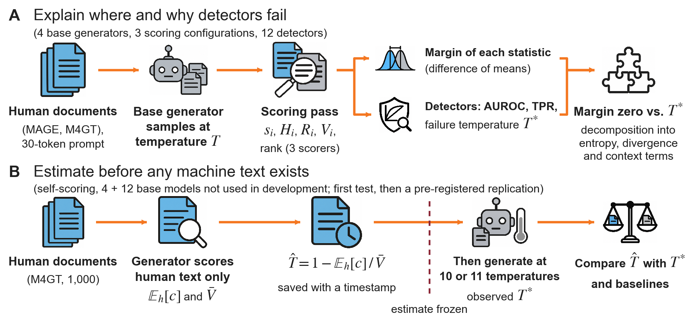
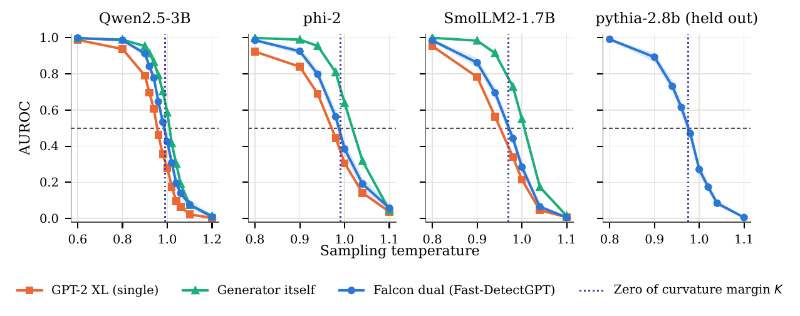
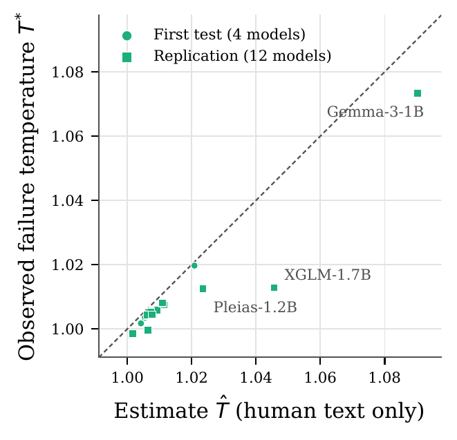

# Estimating Self-Scoring AI-Text Detectors' Failure Temperatures from Human Text

Code, data manifests and result tables for the paper
*Estimating Self-Scoring AI-Text Detectors' Failure Temperatures from Human Text* (Yun-Chin Hsu and Te-Lun Yang).

**Abstract.** Zero-shot detectors of machine-generated text need no training data. Two curvature-based detectors, Fast-DetectGPT and Binoculars, compare observed probabilities with a scoring model's expectations. On MAGE text from models aligned through reinforcement learning from human feedback, their area under the receiver operating characteristic curve (AUROC) exceeds 0.95. However, locating the failure temperature, where AUROC crosses 0.5 and above which machine text ranks as more human-like than human text, has required generated samples. We propose a parameter-free, human-only failure-temperature estimate for self-scoring Fast-DetectGPT, evaluated in two prospectively specified studies on the tested documents. Mean absolute error was 0.002 on four new base models. A time-stamped pre-registered replication on twelve more from eleven families missed its accuracy criterion (family mean 0.008), although higher estimates corresponded to higher failure temperatures (r = 0.95); all twelve failure temperatures were overestimated, and a previously fitted slope had lower observed error (0.0053). Seven statistics crossed chance level near equal human and machine mean scores (mean absolute error 0.003). At T = 0.8, dual-model curvature detectors retained 62 to 86 percentage points more true positives at 1% false-positive rate than likelihood statistics. For evaluators, estimates indicate relative failure temperatures among the tested families before generation, without providing exact temperatures.

## Study design



**Figure 1.** Study design. (A) Human and machine continuations of identical prompts are scored once. Each statistic's margin
(difference between machine and human population means) is compared with the temperature where detector AUROC crosses 0.5;
this explains where and why detectors fail but needs machine text from both sides of the failure point. (B) With generator
self-scoring, failure temperature is estimated from human text alone and saved before any machine text is generated, then
tested on four base models unused in development, then twelve more from eleven new families. Blue marks human text and
quantities computed solely from it, gray marks machine text and generating models, orange arrows show step order, and the
dashed line marks where the estimate is frozen. TPR denotes true-positive rate.

## Main results

Numbers below are copied from the paper; every one of them is produced by the script named beside it and stored in `results/`.



**Figure 2.** Fast-DetectGPT AUROC against sampling temperature (300 machine vs. 1,000 human texts per point; band: 95% bootstrap
interval, Falcon dual). The dotted vertical line marks the zero of the curvature margin K under the Falcon scorer, computed from
the same texts. Pythia-2.8b and its M4GT prompts were held out from the development of the margins.
(`scripts/e3_falcon_dual.py`)

**Table 1.** Zero-shot statistics under the Falcon scorer, range over four generators. Own margin: largest distance between the
statistic's chance-level crossing and its own margin zero. K zero: mean distance to the zero of the curvature margin.
† Entropy crosses 0.5 upward. (`scripts/e6_zero_shot_benchmark.py`, `scripts/e8_margin_generality.py`)

| Statistic | Crossing temp. | Own margin | K zero | TPR@1% (T = 0.8) |
| --- | --- | --- | --- | --- |
| Fast-DetectGPT | 0.971 to 0.987 | .004 | .002 | 0.833 to 0.953 |
| Binoculars | 0.970 to 0.987 | .005 | .002 | 0.863 to 0.950 |
| DMAP position (ours) | 0.948 to 0.972 | .002 | .024 | 0.530 to 0.697 |
| LRR | 0.884 to 0.925 | .009 | .075 | 0.120 to 0.287 |
| LogRank | 0.882 to 0.926 | .004 | .074 | 0.100 to 0.290 |
| Likelihood | 0.882 to 0.927 | .006 | .074 | 0.090 to 0.257 |
| Entropy† | 0.808 to 0.900 | .016 | .121 | 0.003 to 0.017 |
| DMAP χ² (ours) | no stable crossing | n/a | n/a | 0.010 to 0.020 |

**Table 2.** Human-only estimate for self-scoring Fast-DetectGPT. E_h[c] and V̄ are measured on 1,000 human continuations;
T̂ = 1 − E_h[c] / V̄ is the estimate; T* is the observed AUROC crossing; error = T* − T̂. CI denotes confidence interval and MAE mean
absolute error; replication rows specify the endpoint and whether the average is over 12 models or 11 families.
(`scripts/e9_theory_prediction.py`, `scripts/e12_replication_test.py`)

| Generator | E_h[c] | V̄ | T̂ | T* (95% CI) | Error |
| --- | --- | --- | --- | --- | --- |
| *Development (crossings known)* | | | | | |
| Qwen2.5-3B | −.091 | 4.33 | 1.0211 | 1.0100 (1.0064 to 1.0135) | −.0111 |
| SmolLM2-1.7B | −.014 | 4.53 | 1.0031 | 1.0053 (1.0014 to 1.0087) | +.0023 |
| phi-2 | −.121 | 4.80 | 1.0252 | 1.0173 (1.0137 to 1.0209) | −.0079 |
| *First test (estimates saved before generation)* | | | | | |
| OLMo-2-0425-1B | −.021 | 4.95 | 1.0042 | 1.0017 (0.9982 to 1.0047) | −.0025 |
| Granite-3.3-2B | −.028 | 3.86 | 1.0072 | 1.0045 (1.0011 to 1.0072) | −.0026 |
| GPT-Neo-1.3B | −.030 | 5.45 | 1.0055 | 1.0035 (1.0004 to 1.0064) | −.0020 |
| BLOOM-1b7 | −.117 | 5.59 | 1.0209 | 1.0197 (1.0163 to 1.0227) | −.0012 |

| Mean absolute error | Value |
| --- | --- |
| First test: formula | **.0021** |
| First test: assuming T* = 1 | .0074 |
| First test: development mean 1.011 | .0080 |
| Replication, family MAE against full-data T*: formula (largest .033) | .0080 |
| Replication, family MAE against full-data T*: slope fitted on 7 earlier models | .0053 |
| Replication, family MAE against full-data T*: assuming T* = 1 | .0123 |
| Replication, MAE against other-half T*: formula | .0081 (models), .0085 (families) |
| Replication, MAE against other-half T*: direct measurement on one half | .0024 (models), .0023 (families) |

**Replication results by family** (Appendix Table 9). Error = T* − T̂; the two Danube models are averaged within their family.
The slope is fitted on seven earlier models; direct measurement uses one half of the prompts and is evaluated against the other
half's crossing in Table 2, rather than the full-data T* shown here. For baseline b, improvement d_f(b) is baseline absolute
error minus formula absolute error, averaged within family; positive values mean that the formula was closer. These comparisons
are descriptive, conditional on the tested documents and families, and untested. (`scripts/e12_replication_test.py`)

| Family | T̂ | T* | Error | Slope | Direct | d_f(1) | d_f(1.0089) |
| --- | --- | --- | --- | --- | --- | --- | --- |
| Llama | 1.0017 | 0.9985 | −0.0032 | 1.0012 | 0.9984 | −0.0017 | +0.0072 |
| Gemma | 1.0903 | 1.0733 | −0.0169 | 1.0539 | 1.0716 | +0.0564 | +0.0475 |
| TinyLlama | 1.0115 | 1.0075 | −0.0040 | 1.0080 | 1.0078 | +0.0035 | −0.0026 |
| RedPajama | 1.0093 | 1.0058 | −0.0035 | 1.0066 | 1.0099 | +0.0023 | −0.0004 |
| StableLM | 1.0064 | 0.9996 | −0.0068 | 1.0042 | 1.0000 | −0.0064 | +0.0025 |
| Danube (2 models) | 1.0068 | 1.0047 | −0.0021 | 1.0044 | 1.0066 | +0.0027 | +0.0021 |
| EuroLLM | 1.0062 | 1.0043 | −0.0019 | 1.0042 | 1.0039 | +0.0025 | +0.0027 |
| Salamandra | 1.0077 | 1.0044 | −0.0033 | 1.0053 | 1.0064 | +0.0011 | +0.0012 |
| XGLM | 1.0456 | 1.0128 | −0.0328 | 1.0359 | 1.0124 | −0.0200 | −0.0289 |
| Mamba | 1.0110 | 1.0080 | −0.0029 | 1.0077 | 1.0066 | +0.0051 | −0.0021 |
| Pleias | 1.0235 | 1.0125 | −0.0110 | 1.0179 | 1.0123 | +0.0014 | −0.0075 |

<p align="center">

</p>

**Appendix Figure 7.** Human-text-only estimates T̂ versus observed failure temperatures T* for 16 models, each scoring its own
text. Filled circles denote the first test (4 models); filled squares denote the replication (12 models). The dashed diagonal
indicates equality; points below it are overestimates. Names identify the three replication models with the largest absolute
errors. (`paper/make_figs.py`)

The replication did not succeed: twelve models from eleven families had a family mean absolute error of 0.0080, exceeding the
registered 0.005 limit; the fitted slope had 0.0053. Criterion 2 held (r = 0.95): estimates and observed failure temperatures were positively correlated among the eleven tested families. All twelve estimates were high, and error increased with the estimate's distance from T = 1. Attributing
this pattern to the omitted second-order term is post hoc and untested. The families were selected rather than sampled, so these
findings do not extend beyond them. Per-family results are in `results/e12_replication_test/`.

---

## How to run

### Installation

```bash
conda create -n cmargin python=3.13
conda activate cmargin
pip install -r requirements.txt
```
`requirements.txt` pins the exact versions that produced `results/`. The pins matter for the cross-validated pilot tables:
scikit-learn's `GroupKFold` assigns equally sized groups to folds in an order that depends on numpy's sorting routine, so other
numpy versions reproduce the conclusions but not every digit.
The analyses in `scripts/` run on a CPU in minutes. The notebooks need one GPU with at least 40 GB of memory
(Falcon-7B-Instruct and Falcon-7B are loaded together); we used a Colab A100 40GB.

### Reproducing the numbers

**Option A: from our released scores (no GPU).**
```bash
python scripts/download_data.py            # fetches generated continuations and per-token scores into data/
python scripts/run_all.py -j 4             # all analyses in dependency order, about 40 minutes on a laptop
python paper/make_figs.py                  # writes paper/figs/*.pdf
```
Each script prints its tables and writes CSV files to `results/`. We checked this path end to end: running `run_all.py` on the
released data with the pinned environment reproduces every table in `results/` that `run_all.py` covers (`a01` to `e11`); the 53 tables of the original study match the original research outputs cell for cell. Set `CMARGIN_DATA` and `CMARGIN_RESULTS` to use other folders.
`scripts/a07_raid.py analyze` and `scripts/a10_temptest.py analyze` read cached scores; without `analyze` they re-score.
The replication result tables are included in `results/e12_replication_test/`. Rerunning that analysis additionally requires
its original registration metadata, which is not included in this publication snapshot:
`python scripts/e12_replication_test.py --registration /path/to/original/registration.json`.
The script retains its original integrity checks; see its usage instructions for the required stage files.

**Option B: from scratch (GPU).** Upload the repository to Google Drive, set `DATA_DIR` in the first code cell of each
notebook, and run `notebooks/01` to `12` in order (`13` to `15` are the later studies and run after them). Notebooks `01`, `03`, `04` and `05` import `token_info` from `DATA_DIR`,
so copy `notebooks/token_info.py` into `DATA_DIR` before running them. Human texts are rebuilt from the public sources:
MAGE (downloaded by the notebooks), M4GT-Bench Subtask B (`SubtaskB.jsonl` from the
[M4GT-Bench repository](https://github.com/mbzuai-nlp/M4GT-Bench), saved as `data/external/m4gt/SubtaskB.jsonl` and checked against
the SHA-256 in `data/manifests/`) and RAID (`train_none.csv` from the [RAID repository](https://github.com/liamdugan/raid),
saved as `data/external/raid/train_none.csv`).

All sampling uses fixed seeds, but GPU kernels are not bit-deterministic; re-generated texts will differ slightly from ours,
so exact reproduction of the paper numbers requires the released continuations (Option A).

## Repository layout

| Path | What it contains |
| --- | --- |
| `notebooks/01` to `15` | GPU notebooks (Google Colab, A100) that generate the paired continuations and score them. `13` is the first human-only estimate test, `14` the re-tokenization diagnostic and `15` the replication. |
| `notebooks/token_info.py` | Continuation and paraphrase helper imported by the pilot notebooks `01`, `03`, `04` and `05` (unchanged from the pilot stage; its comments are in Chinese). |
| `scripts/a01` to `a12` | CPU analyses of the pilot experiments (Appendices A to C; RAID in Appendix F.2). |
| `scripts/e1` to `e13` | CPU analyses of the main experiments: every number in the main tables and figures. `e8` to `e10` were added on 2026-09-29 after an audit (see Analysis history below); `e11` and `e12_replication_test.py` are the analyses of the two later pre-registered studies, `e12_power.py` is the power simulation of the replication, and `e13_paired_crossing_ci.py` is a post hoc recomputation of the first study's failure-temperature intervals with a document-level bootstrap. |
| `docs/prereg/`, `scripts/check_registration.py` | A publication copy of the replication protocol and the original registration utility. Historical registration records are not included in this snapshot. |
| `scripts/prepare/` | Scoring helpers and the scripts that froze the M4GT manifests. |
| `cmargin/` | Shared code: data paths, the crossing interpolation, DivEye features, blind-spot feature builder. |
| `tests/` | Unit tests of the crossing interpolation, the registration checks and the replication analysis. |
| `data/` | Released data after `scripts/download_data.py`; numbered folders match the notebook numbers. Only `data/manifests/` (frozen M4GT manifests, no text) is in git. |
| `results/` | Every result table (CSV), in one folder per script: `results/<script>/<table>.csv`. |
| `paper/make_figs.py` | Draws the data figures of the paper from `results/`. |

| Paper item | Notebook(s) | Analysis script |
| --- | --- | --- |
| Appendix A, MAGE by family | `prepare/score_mage.py` | `a01_mage_families.py` |
| Appendix A, decoding / alignment / scorer family | `01`, `02` | `a02`, `a03` |
| Appendices A and C, pilot temperature sweep, blind-spot signals | `03` | `a04`, `a05`, `a06`, `a09` |
| Appendix B, TempTest | `03` | `a10_temptest.py analyze` |
| Appendix A, new generators, paraphrase | `04`, `05` | `a11`, `a12` |
| Appendix F.2, RAID | none | `a07_raid.py`, `a08_raid_compare.py` |
| §5.1 and §5.2, development generators | `06` | `e1_scaled_sweep.py`, `e2_curvature_margin.py` |
| §5.1 and §5.2, Falcon scorer; Figure 2 | `07` | `e3_falcon_dual.py` |
| §5.2, held-out pythia-2.8b | `09` | `e5_heldout_pythia.py` |
| Table 1, zero-shot benchmark | `07`, `09`, `10` | `e6_zero_shot_benchmark.py` |
| §5.2 and Appendix F, margins against direct measurement | none | `e8_margin_generality.py` |
| §5.3 and Table 2, first human-only estimate test | `13` | `e9_theory_prediction.py` |
| §5.3, Table 2, Appendix Tables 8 and 9 and Appendix Figure 7, replication | `15` | `e12_replication_test.py` |
| §5.4, combination of statistics | `13` | `e10_blind_spot_combination.py` |
| §6, re-tokenization diagnostic | `14` | `e11_retokenization_diagnostic.py` |
| Appendix G, evaluation exceptions: intervals with the pairing kept (post hoc) | none | `e13_paired_crossing_ci.py` |
| Appendix F.1 and Table 10, trained baselines | `11`, `12` | `e7_trained_baselines.py` |
| Appendix F.2, M4GT-Bench | `08` | `e4_m4gt_natural.py` |

Each analysis script writes its tables to `results/<script name>/`, e.g. `scripts/e3_falcon_dual.py` to `results/e3_falcon_dual/`.

## Data layout

The released data are on Hugging Face: [cookieiweq/curvature-margin](https://huggingface.co/datasets/cookieiweq/curvature-margin)
(private until the paper is published; `scripts/download_data.py` needs `hf auth login` with access until then).

See [`data/README.md`](data/README.md). Released data contain only text we generated and per-token scores; human texts from
M4GT-Bench and RAID are not redistributed and are rebuilt from the manifests.

## Analysis history (audit of 2026-09-29)

An audit found that the curvature margin K has no predictive advantage of its own. K is the population-mean difference of the
curvature statistic's numerator: the mean Fast-DetectGPT score difference locates the failure point equally well, a direct
AUROC estimate on half of the data is at least as accurate, and every zero-shot statistic's own mean margin locates its own
failure point (`scripts/e8_margin_generality.py`). The paper therefore presents the margins as an explanation of
where and why detectors fail. A human-only estimate of the self-scoring failure temperature was specified on
2026-09-29, before its test, and tested in `notebooks/13_theory_prediction_test.ipynb` (`scripts/e9_theory_prediction.py`): on four new base
models its mean absolute error was 0.0021, against 0.0074 for guessing T* = 1 and 0.0080 for the
development mean, meeting both criteria fixed beforehand. A zero-shot combination, specified while that test was running, of statistics with different
failure points (`scripts/e10_blind_spot_combination.py`) raised the worst-case AUROC in all four models but lost more than the
allowed 0.03 AUROC near the crossing, so it did not meet its criterion.

## Pre-registration

Every experiment was specified in a dated design document before it was run, including its analysis script and numerical
expectations; unmet expectations are reported in the paper (Appendix E).

The replication was registered in three steps in the original project: protocol and code (R0), model list (R1), and
estimates (R2). This publication snapshot contains the analysis code and results, with a new Git history. It does not
include the original registration records, checksum lists, timestamp proofs, commits, tags or GitHub Releases.
Consequently, this repository alone does not independently establish the preregistration dates reported in the paper.

The protocol and notebook instructions have been edited for publication; the study design, numerical settings and
executable logic are unchanged. The original records are archived separately. The file and folder names of notebook 13
keep the word "prediction" from the original study; the paper calls the formula's output an estimate.

## Citation

```bibtex
@misc{hsu2027curvature,
  title  = {Estimating Self-Scoring AI-Text Detectors' Failure Temperatures from Human Text},
  author = {Hsu, Yun-Chin and Yang, Te-Lun},
  year   = {2027},
  note   = {Code: https://github.com/hsuiris/curvature-margin}
}
```

## License

Code is released under the MIT License. Generated data follow the licenses of the generating models and source datasets
(see `data/README.md`).
